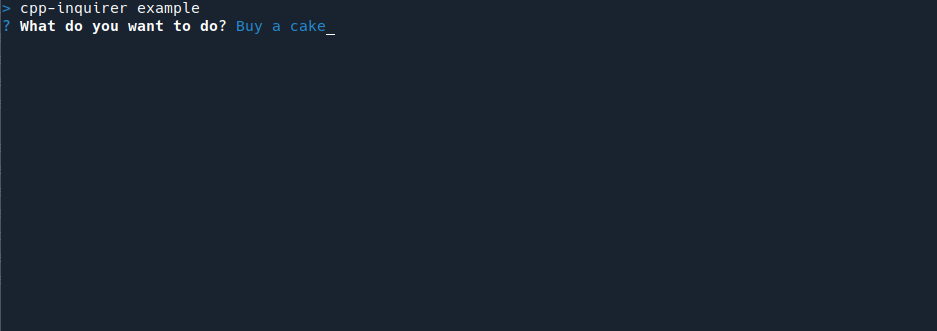
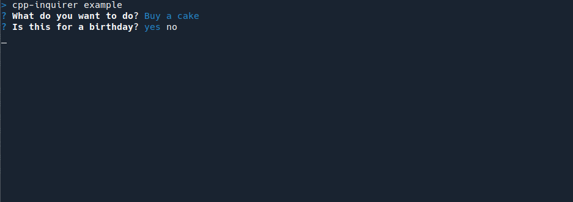
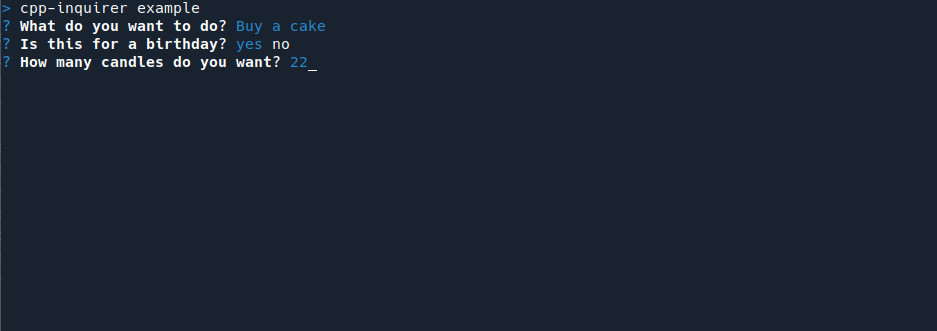
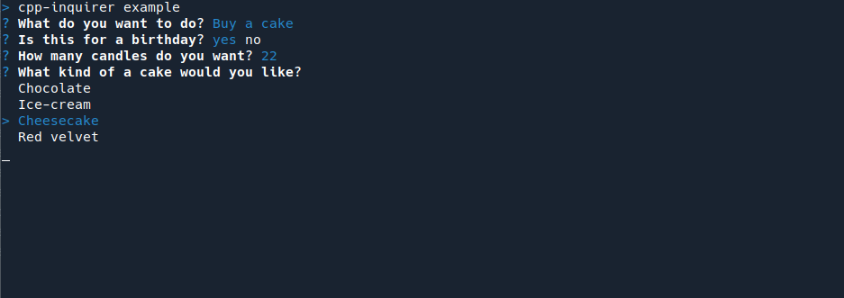
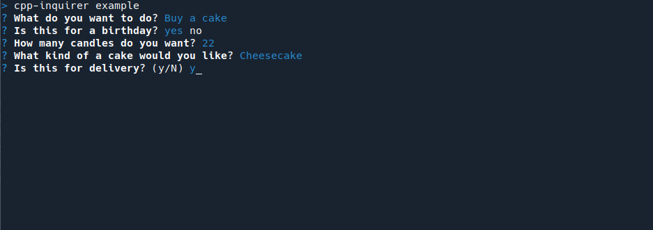
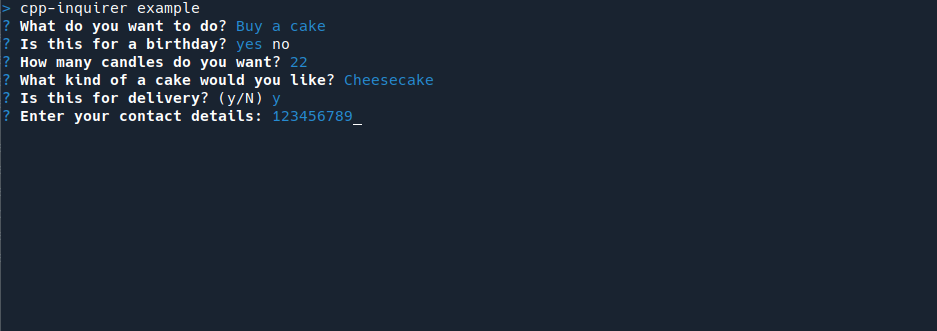

# C++ Inquirer

A single header C++11 library for interactive command line prompts.

# Use

Simply include the header:
```cpp
#include "inquirer.h"
```
And initialise the inquirer object (with optional title):
```cpp
auto inquirer = alx::Inquirer("cpp-inquirer example");
```
There are two ways to get answers back:

```cpp
// Adds a question.
inquirer.add_question({"query", "What do you want to do?" });
// Prompts the user with all questions at once.
inquirer.ask();
/* With the key of your question. You will get a std::string as a value, so you will need to convert
   it to an appropriate type yourself. */
inquirer.answer("query"); 
```
or

```cpp
// Adds a question and immediately prompts the user for an answer.
std::string answer = inquirer.add_question({ "query", "What do you want to do?" }).ask();
```

If you mix both of these approaches the question already answered will not be asked again.
If you wish to ask the same question more than once call:

```cpp
inquirer.ask(true);
```

Alternatively, if you have unrelated question or prefer to manage them individually you can use
the `alx::Question` class directly:

```cpp
std::string answer = alx::Question{"key", "What do you want to do?"}.ask(); // Key is not used in this case, so any value will do.
// Or
alx::Question question{"key", "What do you want to do?"};
std::string answer = question.ask();
```

# Prompts

## Text



```cpp
inquirer.add_question({ "query", "What do you want to do?" });
```

## Yes/No



```cpp
inquirer.add_question({ "birthday", "Is this for a birthday?", alx::Type::yesNo });
```
## Integer or decimal



```cpp
inquirer.add_question({ "candles", "How many candles do you want?", alx::Type::integer });
// Or
inquirer.add_question({ "candles", "How many candles do you want?", alx::Type::decimal });
```

## Select



```cpp
inquirer.add_question({ "type", "What kind of a cake would you like?",
		        std::vector<std::string>{ "Chocolate", "Ice-cream", "Cheesecake", "Red velvet" }});
```

## Confirm



```cpp
inquirer.add_question({ "delivery", "Is this for delivery?", alx::Type::confirm });
```

## Regex validated input



```cpp
inquirer.add_question({ "number", "Enter your contact details:", "\\d{9}" });
```

## Password

Password questions hide user input.


```cpp
inquirer.add_question({ "number", "Enter your contact details:", alx::Type::password });
```

# Contributing

I'm more than happy to accept pull requests with some minor requirements:

- Prefix your commit messages with a relevant change type. If the commit relates to a GitHub issue, include the issue number in the message. Example:
> Types: added a new question type 'yes/no'
> 
> This addresses issue #123

or

> Answers: added a way to return an answer with the correct type

- Please follow the naming convention already established in the code. There is no clangformat, but I'm sure you can deduce it yourself.
